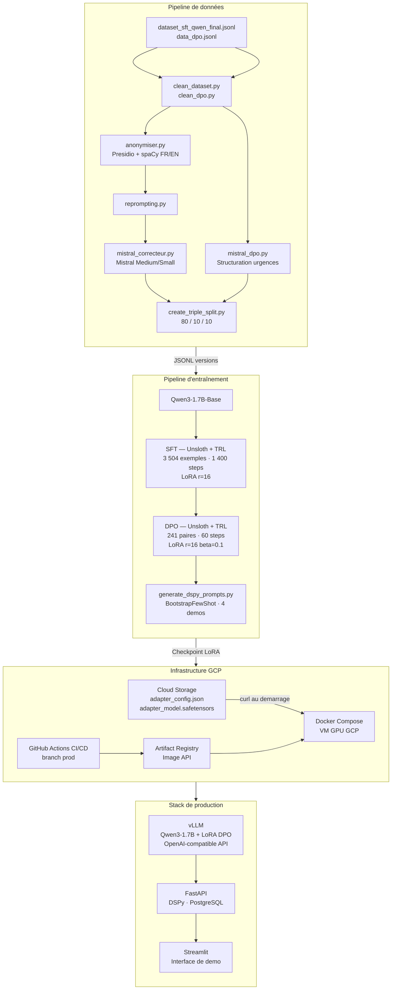

# Medical Chatbot Triage — POC CHSA

> Agent IA de triage médical développé pour le Centre Hospitalier Saint-Aurélien (CHSA) afin d'assister le personnel soignant dans la priorisation des patients aux urgences.

---

## Architecture



---

## Stack technique

| Composant | Technologie |
|---|---|
| Modele de base | Qwen/Qwen3-1.7B-Base |
| Fine-tuning | Unsloth · TRL (SFTTrainer · DPOTrainer) · LoRA (r=16) |
| Quantisation | BitsAndBytes 4-bit (NF4) |
| Optimisation prompts | DSPy BootstrapFewShot |
| Anonymisation | Presidio · spaCy (fr_core_news_md · en_core_web_sm) |
| Correction dataset | Mistral Medium / Small (API) |
| Serveur de modele | vLLM (OpenAI-compatible) |
| API | FastAPI · Uvicorn · SQLAlchemy · PostgreSQL |
| Interface | Streamlit |
| Tracking experiences | MLflow |
| Stockage modele | Google Cloud Storage |
| CI/CD | GitHub Actions · Google Artifact Registry |
| Conteneurisation | Docker · Docker Compose |

---

## Format de sortie du modele

Le modele repond en **JSON strict** selon deux cas :

```json
// Cas 1 — informations suffisantes
{
  "type": "final",
  "urgence": "Haute | Moyenne | Faible",
  "analyse": "Justification medicale et recommandation.",
  "question": null
}

// Cas 2 — informations insuffisantes
{
  "type": "question",
  "urgence": null,
  "analyse": null,
  "question": "Question ciblee de clarification."
}
```

---

## Structure du projet

```
medical-chatbot/
│
├── api/                        # Backend FastAPI
│   ├── controllers/            # Routes HTTP
│   ├── dspy/                   # Module DSPy + prompts optimises
│   │   ├── signatures.py
│   │   └── dspy_optimized_triage_dpo.json
│   ├── services/               # Logique metier (chatbot, logs)
│   ├── schemas/                # Modeles Pydantic
│   ├── database/               # SQLAlchemy (modeles + session)
│   ├── main.py
│   ├── requirements.txt
│   └── Dockerfile
│
├── interface/                  # Frontend Streamlit
│   ├── app.py
│   └── Dockerfile
│
├── scripts/                    # Pipeline de donnees et entrainement
│   ├── clean_dataset.py        # Nettoyage SFT
│   ├── clean_dpo.py            # Nettoyage DPO
│   ├── anonymiser.py           # Anonymisation Presidio
│   ├── reprompting.py          # Remplacement system prompt
│   ├── mistral_correcteur.py   # Correction/validation par Mistral
│   ├── mistral_dpo.py          # Structuration paires DPO par Mistral
│   ├── create_triple_split.py  # Split SFT 80/10/10
│   ├── create_triple_split_dpo.py
│   ├── train_Unsloth_sft.py    # Entrainement SFT
│   ├── train_Unsloth_dpo.py    # Entrainement DPO
│   ├── generate_dspy_prompts.py# Optimisation prompts DSPy
│   └── validateur.py           # Inspection dataset
│
├── data/
│   └── data_versioned/
│       ├── sft/                # sft_{train,val,test}_v2.0.0.jsonl
│       └── dpo/                # dpo_{train,val,test}_v1.0.0.jsonl
│
├── models/                     # Checkpoints LoRA locaux
├── notebook/                   # Exploration et analyse
├── docker-compose.yml
├── exemples_demo.txt           # Cas de demonstration
└── .env.example
```

---

## Donnees d'entrainement

| Dataset | Train | Val | Test | Total |
|---|---|---|---|---|
| SFT | 3 504 | 438 | 439 | **4 381** |
| DPO | 241 | 30 | 31 | **302** |

**Sources** : donnees medicales publiques (MedQuAD, cas cliniques FR/EN), enrichies et corrigees via Mistral API.

**Pipeline de qualite** :
1. Nettoyage syntaxique et structurel
2. Anonymisation automatique (Presidio, seuil 0.8) avec bypass symptomes/traitements
3. Remplacement du system prompt (format JSON unifie)
4. Correction et validation par Mistral Medium/Small
5. Structuration des niveaux d'urgence pour les paires DPO

---

## Installation locale

### Prerequis

- Python 3.12+
- CUDA 11.8+ · GPU NVIDIA (>= 6 Go VRAM pour inference 4-bit)
- Docker + Docker Compose (pour le stack complet)
- `uv` (gestionnaire de paquets)

### Variables d'environnement

Copier `.env.example` en `.env` et renseigner :

```env
DB_USER=postgres
DB_PASSWORD=changeme
DB_NAME=medical_chatbot

MODEL_ID=Qwen/Qwen3-1.7B-Base
VLLM_DTYPE=float16
HF_TOKEN=hf_xxx

GCS_LORA_BASE_URL=https://storage.googleapis.com/lora-matrice

MISTRAL_API_KEY=xxx   # uniquement pour les scripts de preparation des donnees
```

### Lancer le stack complet

```bash
docker compose up --build
```

| Service | URL |
|---|---|
| API FastAPI | http://localhost:8080 |
| Interface Streamlit | http://localhost:8501 |
| Docs API (Swagger) | http://localhost:8080/docs |

---

## API

### `POST /triage/ask`

```bash
curl -X POST http://localhost:8080/triage/ask \
  -H "Content-Type: application/json" \
  -d '{"symptomes": "Douleur thoracique violente depuis 20 minutes, transpiration, essoufflement."}'
```

**Reponse — urgence haute :**
```json
{
  "status": "ANALYSE",
  "data": {
    "urgence": "Haute",
    "analyse": "Tableau evocateur de syndrome coronaire aigu. Appeler le 15 immediatement."
  },
  "latency": 1.23
}
```

**Reponse — question de clarification :**
```json
{
  "status": "ASSISTANT",
  "question": "La douleur est-elle localisee d'un cote precis ? Avez-vous de la fievre ?",
  "latency": 0.87
}
```

### `GET /triage/logs`

Retourne l'historique des triages enregistres en base de donnees.

---

## Pipeline d'entrainement

```bash
# 1. Preparation des donnees SFT
python scripts/clean_dataset.py
python scripts/anonymiser.py
python scripts/reprompting.py
python scripts/mistral_correcteur.py
python scripts/create_triple_split.py

# 2. Entrainement SFT
python scripts/train_Unsloth_sft.py

# 3. Preparation des donnees DPO
python scripts/clean_dpo.py
python scripts/mistral_dpo.py
python scripts/create_triple_split_dpo.py

# 4. Entrainement DPO (depuis le checkpoint SFT)
python scripts/train_Unsloth_dpo.py

# 5. Optimisation des prompts DSPy
python scripts/generate_dspy_prompts.py --adapter dpo
```

---

## Deploiement GCP

Le CI/CD est declenche sur push vers la branche `prod` via GitHub Actions :

1. Authentification GCP (Workload Identity Federation)
2. Build de l'image API vers Google Artifact Registry
3. Deploiement sur VM GPU via Docker Compose
4. Le LoRA DPO est telecharge automatiquement depuis Cloud Storage au demarrage de vLLM

---
