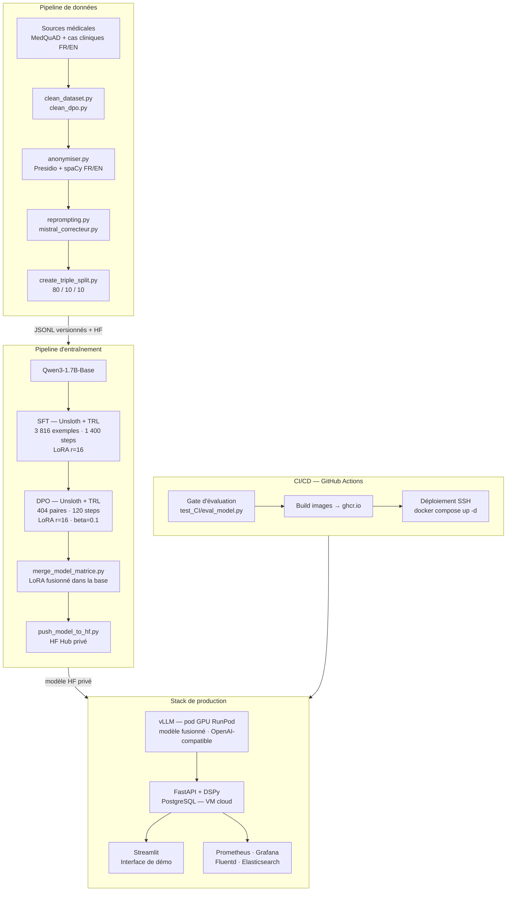

# Medical Chatbot Triage — POC CHSA

> Agent IA de triage médical développé pour le Centre Hospitalier Saint-Aurélien (CHSA) afin d'assister le personnel soignant dans la priorisation des patients aux urgences.

---

## Architecture


```mermaid
flowchart TD
    subgraph DATA["Pipeline de données"]
        direction TB
        D1[Sources médicales\nMedQuAD + cas cliniques FR/EN]
        D2[clean_dataset.py\nclean_dpo.py]
        D3[anonymiser.py\nPresidio + spaCy FR/EN]
        D4[reprompting.py\nmistral_correcteur.py]
        D5[create_triple_split.py\n80 / 10 / 10]
        D1 --> D2 --> D3 --> D4 --> D5
    end

    subgraph TRAIN["Pipeline d'entraînement"]
        direction TB
        T1[Qwen3-1.7B-Base]
        T2[SFT — Unsloth + TRL\n3 816 exemples · 1 400 steps\nLoRA r=16]
        T3[DPO — Unsloth + TRL\n404 paires · 120 steps\nLoRA r=16 · beta=0.1]
        T4[merge_model_matrice.py\nLoRA fusionné dans la base]
        T5[push_model_to_hf.py\nHF Hub privé]
        T1 --> T2 --> T3 --> T4 --> T5
    end

    subgraph SERVE["Stack de production"]
        direction TB
        S1[vLLM — pod GPU RunPod\nmodèle fusionné · OpenAI-compatible]
        S2[FastAPI + DSPy\nPostgreSQL — VM cloud]
        S3[Streamlit\nInterface de démo]
        S4[Prometheus · Grafana\nFluentd · Elasticsearch]
        S1 --> S2 --> S3
        S2 --> S4
    end

    subgraph CICD["CI/CD — GitHub Actions"]
        C1[Gate d'évaluation\ntest_CI/eval_model.py]
        C2[Build images → ghcr.io]
        C3[Déploiement SSH\ndocker compose up -d]
        C1 --> C2 --> C3
    end

    DATA -->|JSONL versionnés + HF| TRAIN
    TRAIN -->|modèle HF privé| SERVE
    CICD --> SERVE
```

---

## Stack technique

| Composant | Technologie |
|---|---|
| Modèle de base | Qwen/Qwen3-1.7B-Base |
| Fine-tuning | Unsloth · TRL (SFTTrainer · DPOTrainer) · LoRA (r=16) |
| Quantisation (train) | BitsAndBytes 4-bit (NF4) |
| Optimisation prompts | DSPy — bootstrap few-shot |
| Anonymisation | Presidio · spaCy (fr_core_news_md · en_core_web_sm) |
| Correction dataset | Mistral Medium / Small (API) |
| Serveur de modèle | vLLM (OpenAI-compatible) — pod GPU RunPod |
| API | FastAPI · Uvicorn · SQLAlchemy · PostgreSQL |
| Interface | Streamlit |
| Monitoring | Prometheus · Grafana · Fluentd · Elasticsearch |
| Tracking expériences | MLflow |
| Modèle & datasets | Hugging Face Hub (repos privés) |
| CI/CD | GitHub Actions · ghcr.io · déploiement SSH sur VM cloud |
| Conteneurisation | Docker · Docker Compose |

---

## Format de sortie du modèle

Le modèle répond en **JSON strict** selon deux cas :

```json
// Cas 1 — informations suffisantes
{
  "type": "final",
  "urgence": "Haute | Moyenne | Faible",
  "analyse": "Justification médicale et recommandation.",
  "question": null
}

// Cas 2 — informations insuffisantes
{
  "type": "question",
  "urgence": null,
  "analyse": null,
  "question": "Question ciblée de clarification."
}
```

---

## Structure du projet

```
medical-chatbot/
│
├── api/                        # Backend FastAPI
│   ├── controllers/            # Routes HTTP
│   ├── dspy/                   # Module DSPy + prompts optimisés
│   │   ├── signatures.py       # TriageModule (profil sft par défaut)
│   │   ├── dspy_optimized_triage_sft.json
│   │   └── dspy_optimized_triage_dpo.json
│   ├── services/               # Logique métier (chatbot, logs, métriques)
│   ├── schemas/                # Modèles Pydantic
│   ├── database/               # SQLAlchemy (modèles + session)
│   ├── main.py
│   └── Dockerfile
│
├── interface/                  # Frontend Streamlit
│   ├── app.py
│   └── Dockerfile
│
├── scripts/
│   ├── dataset/                # Pipeline de données
│   │   ├── clean_dataset.py · clean_dpo.py
│   │   ├── anonymiser.py       # Presidio + spaCy
│   │   ├── reprompting.py · mistral_correcteur.py · mistral_dpo.py
│   │   ├── gen_mistral_questions.py   # cas multi-tours
│   │   └── analyze_sft_dataset.py     # statistiques du dataset (rapport --md)
│   ├── training/
│   │   ├── train_Unsloth_sft.py
│   │   └── train_Unsloth_dpo.py
│   ├── ops/
│   │   ├── create_triple_split.py · create_triple_split_dpo.py
│   │   ├── merge_model_matrice.py     # fusion LoRA -> modèle complet
│   │   ├── push_to_hf.py              # publication datasets
│   │   ├── push_model_to_hf.py        # publication modèle
│   │   ├── setup_pod_native.sh        # setup vLLM sur pod RunPod
│   │   └── update_runpod_url.sh       # repointe l'API vers le pod courant
│   └── generate_dspy_prompts.py       # optimisation prompts DSPy
│
├── test_CI/                    # Gate d'évaluation CI
│   ├── eval_dataset.py         # 24 cas cliniques FR/EN (dont 4 multi-tours)
│   └── eval_model.py           # métriques + seuils bloquants
│
├── data/data_versioned/
│   ├── sft/                    # sft_{train,val,test}_v2.0.0.jsonl
│   └── dpo/                    # dpo_{train,val,test}_v2.0.0.jsonl
│
├── monitoring/ · prometheus/ · grafana/ · fluentd/   # observabilité
├── .github/workflows/deploy-ovh.yml                  # CI/CD
├── docker-compose.yml          # stack locale (GPU)
├── docker-compose.prod.yml     # stack production
└── .env.example
```

---

## Données d'entraînement

| Dataset | Train | Val | Test | Total | Repo HF (privé) |
|---|---|---|---|---|---|
| SFT v2.0.0 | 3 816 | 477 | 478 | **4 771** | huggingjojo/medical-bilingual-sft |
| DPO v2.0.0 | 404 | 48 | 48 | **500** | huggingjojo/medical-bilingual-dpo |

**Sources** : données médicales publiques (MedQuAD, cas cliniques FR/EN), enrichies et corrigées via Mistral API. Bilingue FR/EN, multi-tours (question de clarification → verdict).

**Pipeline de qualité** :
1. Nettoyage syntaxique et structurel
2. Anonymisation automatique (Presidio, seuil 0.8) avec bypass des termes médicaux — conformité RGPD
3. System prompt unifié injecté dans chaque exemple (le même est réutilisé à l'inférence)
4. Correction et validation par Mistral Medium/Small
5. Enrichissement multi-tours et structuration des paires DPO
6. Split 80/10/10 reproductible, versionné

---

## Modèle

Le modèle de production est le **fusionné SFT v2 + DPO v2** (LoRA mergé dans la base), publié sur HF privé : `huggingjojo/medical-chatbot-model`.

Résultats sur la gate d'évaluation (24 cas, run du 17/07/2026) :

| Métrique | Valeur | Seuil |
|---|---|---|
| Rappel « Haute » (sécurité patient) | **1.00** (6/6) | ≥ 0.90 |
| Accuracy globale | **0.88** (21/24) | ≥ 0.70 |
| Flux multi-tours (question T1 · verdict T2) | **2/2 · 2/2** | — |
| Arrêt EOS propre | **100 %** (28/28) | — |
| Latence GPU (bout en bout) | P95 ≈ 1.8 s | < 3 s |

Les 3 écarts vont tous dans le sens de la prudence (question posée ou sur-triage) — jamais une urgence sous-évaluée.

---

## Installation locale

### Prérequis

- Python 3.12+
- CUDA 11.8+ · GPU NVIDIA (≥ 6 Go VRAM pour l'inférence 4-bit)
- Docker + Docker Compose

### Variables d'environnement

Copier `.env.example` en `.env` et renseigner :

```env
DB_USER=postgres
DB_PASSWORD=changeme
DB_NAME=medical_chatbot

HF_TOKEN=hf_xxx        # repos HF privés (modèle + datasets)
VLLM_API_URL=http://localhost:8000/v1

MISTRAL_API_KEY=xxx    # uniquement pour les scripts de préparation des données
```

### Lancer le stack complet

```bash
docker compose up --build
```

| Service | URL |
|---|---|
| API FastAPI | http://localhost:8080 |
| Interface Streamlit | http://localhost:8501 |
| Docs API (Swagger) | http://localhost:8080/docs |
| Grafana | http://localhost:3000 |

---

## API

### `POST /triage/ask`

```bash
curl -X POST http://localhost:8080/triage/ask \
  -H "Content-Type: application/json" \
  -d '{"messages": [{"role": "user", "content": "Douleur thoracique violente depuis 20 minutes, transpiration, essoufflement."}]}'
```

**Réponse — urgence haute :**
```json
{
  "status": "ANALYSE",
  "data": {
    "urgence": "Haute",
    "analyse": "Signes évocateurs de syndrome coronaire aigu. Urgence absolue (SAMU/15)."
  },
  "latency": 2.54
}
```

**Réponse — question de clarification :**
```json
{
  "status": "ASSISTANT",
  "question": "La douleur est-elle localisée d'un côté précis ? Avez-vous de la fièvre ?",
  "latency": 0.87
}
```

### `GET /triage/logs`

Retourne l'historique des triages enregistrés en base de données (traçabilité).

---

## Pipeline d'entraînement

```bash
# 1. Préparation des données SFT
python scripts/dataset/clean_dataset.py
python scripts/dataset/anonymiser.py
python scripts/dataset/reprompting.py
python scripts/dataset/mistral_correcteur.py
python scripts/ops/create_triple_split.py

# 2. Entraînement SFT
python scripts/training/train_Unsloth_sft.py

# 3. Préparation des données DPO
python scripts/dataset/clean_dpo.py
python scripts/dataset/mistral_dpo.py
python scripts/ops/create_triple_split_dpo.py

# 4. Entraînement DPO (depuis le checkpoint SFT)
python scripts/training/train_Unsloth_dpo.py

# 5. Optimisation des prompts DSPy
python scripts/generate_dspy_prompts.py --adapter sft

# 6. Fusion LoRA -> modèle complet, puis publication HF
python scripts/ops/merge_model_matrice.py
python scripts/ops/push_model_to_hf.py
```

---

## Évaluation — gate CI

`test_CI/eval_model.py` évalue le modèle sur 24 cas cliniques FR/EN — attendus : 6 Haute · 3 Moyenne · 3 Faible · 12 question, dont 4 scénarios multi-tours à relance patient scriptée — et **bloque le déploiement** si les seuils ne sont pas atteints :

- Rappel « Haute » ≥ 0.90 (ne jamais rater une urgence vitale)
- Accuracy ≥ 0.70 · champs obligatoires : 0 manquant
- Taux d'arrêt EOS propre (seuil optionnel `EOS_STOP_RATE_MIN`)
- Flux multi-tours vérifié dans les deux sens sur les cas marqués `expected_turn1_type="question"` : question exigée au tour 1 ET bon verdict au tour 2 après la relance (rapporté dans le résumé)

```bash
# éval complète locale (24 cas)
EVAL_SAMPLE_LIMIT=24 MODEL_ID=production_model python test_CI/eval_model.py
```

---

## Déploiement

CI/CD déclenché sur push vers `main` (`.github/workflows/deploy-ovh.yml`) :

1. **Gate d'évaluation** — le modèle HF est évalué sur CPU ; échec = déploiement bloqué
2. **Build** des images api / interface / fluentd → ghcr.io (tag = SHA du commit)
3. **Déploiement SSH** sur la VM cloud → `docker compose pull && up -d`
4. Rollback possible par re-dispatch manuel avec un tag antérieur

**Serving du modèle** : vLLM tourne sur un pod GPU RunPod (le modèle est mis en cache sur un volume persistant). À chaque nouveau pod, une seule commande repointe l'API :

```bash
bash scripts/ops/update_runpod_url.sh <POD_ID>
```

Une alternative CPU existe via le profil compose `local-vllm` (vLLM CPU sur la VM), écartée en pratique pour cause de latence.
